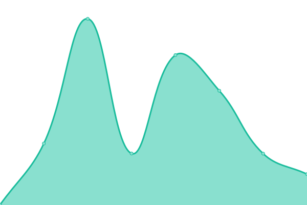

# [📈 Live Status](https://status.dumbbotlist.tk): <!--live status--> **🟥 Complete outage**

This repository contains the open-source uptime monitor and status page for [Dumb List](https://status.dumbbotlist.tk), powered by [Upptime](https://github.com/upptime/upptime).

With [Upptime](https://upptime.js.org), you can get your own unlimited and free uptime monitor and status page, powered entirely by a GitHub repository. We use [Issues](https://github.com/Dumb List/Dumb-List-Status2/issues) as incident reports, [Actions](https://github.com/Dumb List/Dumb-List-Status2/actions) as uptime monitors, and [Pages](https://status.dumbbotlist.tk) for the status page.

<!--start: status pages-->
<!-- This summary is generated by Upptime (https://github.com/upptime/upptime) -->
<!-- Do not edit this manually, your changes will be overwritten -->
<!-- prettier-ignore -->
| URL | Status | History | Response Time | Uptime |
| --- | ------ | ------- | ------------- | ------ |
|  [Main](https://dumbbotlist.tk) | 🟥 Down | [main.yml](https://github.com/dhvitOP/Dumb-List-Status2/commits/HEAD/history/main.yml) | 

 3784ms
     
 | 

<a href="https://status.dumbbotlist.tk/history/main">49.14%</a>
    

|  [Documentation](https://docs.dumbbotlist.tk) | 🟥 Down | [documentation.yml](https://github.com/dhvitOP/Dumb-List-Status2/commits/HEAD/history/documentation.yml) | 

 466ms
     
 | 

<a href="https://status.dumbbotlist.tk/history/documentation">74.58%</a>
    

|  [API](https://dumbbotlist.tk/api) | 🟥 Down | [api.yml](https://github.com/dhvitOP/Dumb-List-Status2/commits/HEAD/history/api.yml) | 

 430ms
     
 | 

<a href="https://status.dumbbotlist.tk/history/api">49.31%</a>
    

|  [Bots](https://dumbbotlist.tk/bots) | 🟥 Down | [bots.yml](https://github.com/dhvitOP/Dumb-List-Status2/commits/HEAD/history/bots.yml) | 

 304ms
     
 | 

<a href="https://status.dumbbotlist.tk/history/bots">49.31%</a>
    

|  [Servers](https://dumbbotlist.tk/server) | 🟥 Down | [servers.yml](https://github.com/dhvitOP/Dumb-List-Status2/commits/HEAD/history/servers.yml) | 

 383ms
     
 | 

<a href="https://status.dumbbotlist.tk/history/servers">49.31%</a>
    

|  [Vanity](https://dumbbotlist.tk/addvanity) | 🟥 Down | [vanity.yml](https://github.com/dhvitOP/Dumb-List-Status2/commits/HEAD/history/vanity.yml) | 

 271ms
     
 | 

<a href="https://status.dumbbotlist.tk/history/vanity">49.31%</a>
    

<!--end: status pages-->

[**Visit our status website →**](https://status.dumbbotlist.tk)

## 📄 License

- Powered by: [Upptime](https://github.com/upptime/upptime)
- Code: [MIT](./LICENSE) © [Dumb List](https://status.dumbbotlist.tk)
- Data in the `./history` directory: [Open Database License](https://opendatacommons.org/licenses/odbl/1-0/)
